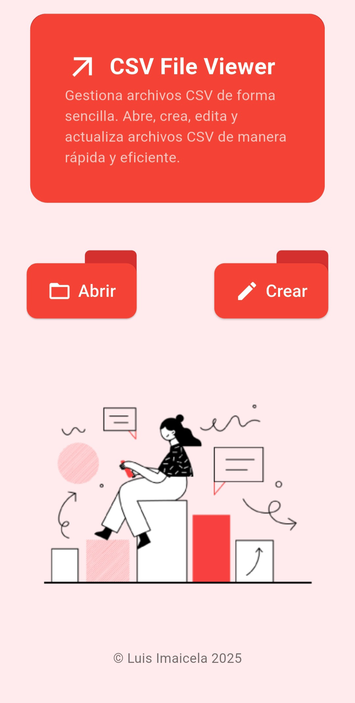
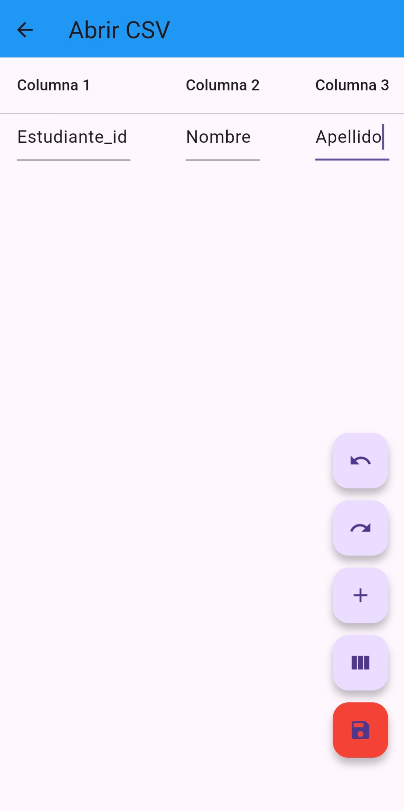

<<<<<<< HEAD
=======
# csv_app_luis_imaicela 📂

CSV File Viewer es una aplicación Flutter que permite gestionar archivos CSV de forma sencilla y eficiente. Puedes abrir, crear, visualizar, editar y guardar archivos CSV con una interfaz moderna basada en Material Design.

## 📥 Descargar APK
Puedes descargar la última versión aquí:

[⬇️ Descargar APK v1.0.0](https://github.com/Luixij/CSV_APP/releases/tag/v1.0.0)


## 🚀 Características
- 📄 Carga archivos CSV y muestra su contenido.
- ✍️ Permite edición y actualización de datos.
- 💾 Guarda cambios en el almacenamiento local.
- 🎨 Interfaz moderna y fácil de usar.

## 📂 Estructura del Proyecto
```
/csv_file_viewer
│── /lib
│   ├── /screens # Pantallas principales
│   ├── /services # Lógica de manejo de archivos CSV
│   ├── main.dart # Punto de entrada de la aplicación
│── /assets
│   ├── /images   # Imágenes para la UI
│── pubspec.yaml  # Dependencias
│── README.md     # Documentación
```

## 📥 Instalación y Uso
1. Clonar el repositorio:
   ```sh
   git clone https://github.com/Luixij/CSV_APP.git
   cd csv_file_viewer
   ```
2. Instalar dependencias:
   ```sh
   flutter pub get
   ```
3. Ejecutar la aplicación:
   ```sh
   flutter run
   ```

## 📦 Dependencias utilizadas
- **path_provider** 📂 (Manejo de almacenamiento local)
- **csv** 📊 (Lectura y escritura de archivos CSV)
- **provider** 🔄 (Manejo de estado)

## 🖼️ Capturas de Pantalla
| Pantalla de Inicio | Pantalla de Edición |
|--------------------|--------------------|
|  |  |

## 📌 Consideraciones de Seguridad
- Los archivos CSV se almacenan en el directorio de documentos del usuario.
- Se maneja un control de errores para evitar corrupciones en los archivos.

## 📜 Licenci
Este proyecto está bajo la licencia MIT. ¡Siéntete libre de contribuir! 🚀
>>>>>>> 2760940 (🚀 Primera versión de csv_app_luis_imaicela)
